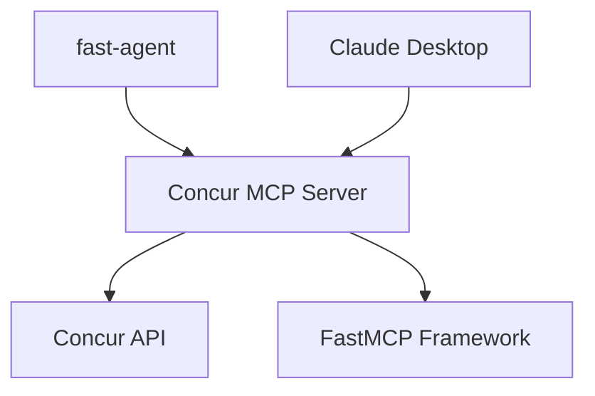

# Concur MCP Server

A **Model Context Protocol (MCP)** server that integrates with **SAP Concur** expense management system, built with **FastMCP** and **fast-agent**.

## 🚀 Features

- **📊 List Expense Reports**: Retrieve and analyze your Concur expense reports
- **🔍 Report Details**: Get detailed information about specific reports  
- **🤖 AI-Powered Analysis**: Claude Sonnet 4.0 provides intelligent expense insights
- **🔌 MCP Integration**: Works with Claude Desktop and fast-agent
- **🔐 Secure Authentication**: OAuth2 password grant flow with Concur API

## 🛠️ Architecture



## 📋 Prerequisites

- **Python 3.10+**
- **SAP Concur Developer Account** with API credentials
- **Anthropic API Key** (for AI analysis)
- **uv** package manager (recommended) or pip

## 🔧 Installation

### 1. Clone the Repository

```bash
git clone https://github.com/yourusername/concur-mcp-server.git
cd concur-mcp-server
```

### 2. Set Up Python Environment

```bash
# Using uv (recommended)
uv venv
source venv/bin/activate  # On Windows: venv\Scripts\activate

# Install dependencies
uv pip install -r requirements.txt
```

### 3. Configure Environment Variables

```bash
# Copy the template
cp env.template .env

# Edit .env with your credentials
nano .env
```

Required variables:
- `CONCUR_CLIENT_ID`: Your Concur app client ID
- `CONCUR_CLIENT_SECRET`: Your Concur app client secret  
- `CONCUR_USERNAME`: Your Concur username
- `CONCUR_PASSWORD`: Your Concur password
- `ANTHROPIC_API_KEY`: Your Anthropic API key

## 🎯 Usage

### Option 1: Fast-Agent (Recommended)

The easiest way to use the Concur MCP server is with **fast-agent**:

```bash
# Quick analysis
uv run concur_expense_agent.py --agent ConcurExpenseAgent --message "Analyze my expense reports"

# Interactive mode
uv run concur_expense_agent.py

# Use different models
uv run concur_expense_agent.py --model sonnet --agent ConcurExpenseAgent --message "Detailed analysis"
```

### Option 2: Claude Desktop Integration

1. **Install the server**:
   ```bash
   fastmcp install claude-code
   ```

2. **Add to Claude Desktop config**:
   ```json
   {
     "mcpServers": {
       "concur-reports": {
         "command": "python",
         "args": ["/path/to/concur-mcp-server/concur_mcp_server.py"],
         "env": {
           "CONCUR_CLIENT_ID": "your_client_id",
           "CONCUR_CLIENT_SECRET": "your_client_secret",
           "CONCUR_USERNAME": "your_username", 
           "CONCUR_PASSWORD": "your_password"
         }
       }
     }
   }
   ```

### Option 3: Standalone MCP Server

```bash
# Start as HTTP server
python concur_mcp_server.py --server --transport http --port 8080

# Start as stdio server  
python concur_mcp_server.py --server --transport stdio
```

## 🔨 Available Tools

| Tool | Description |
|------|-------------|
| `list_concur_reports` | Retrieve expense reports with optional limit |
| `get_concur_report_details` | Get detailed information about a specific report |
| `test_concur_connection` | Test the connection to Concur API |

## 📊 Example Analysis

The AI agent provides intelligent insights like:

```
## Expense Reports Summary

### Total Value: $4,401.52 across 7 reports

### Status Breakdown:
- 5 reports Submitted & Pending Approval ($2,521.00)
- 2 reports Not Submitted ($1,880.52)

### Recommendations:
1. Follow up on old pending reports
2. Submit draft reports worth $1,880.52
3. Review approval process workflow
```

## 🔧 Configuration

### Fast-Agent Configuration

Edit `fastagent.config.yaml`:

```yaml
# Set default model
default_model: "sonnet"  # Claude Sonnet 4.0

mcp:
  servers:
    concur_reports:
      command: "python"
      args: ["/path/to/concur_mcp_server.py"]
      env:
        CONCUR_CLIENT_ID: "your_client_id"
        CONCUR_CLIENT_SECRET: "your_client_secret"
        CONCUR_USERNAME: "your_username"
        CONCUR_PASSWORD: "your_password"
```

### Secrets Configuration

Edit `fastagent.secrets.yaml`:

```yaml
anthropic:
  api_key: "your_anthropic_api_key"
```

## 🧪 Testing

```bash
# Test the MCP server directly
python simple_test.py

# Test fast-agent configuration
fast-agent check
```

## 🚨 Security Notes

- **Never commit** `.env`, `fastagent.secrets.yaml`, or any files with credentials
- Use **environment variables** or **secure secret management** in production
- The `.gitignore` file protects sensitive files from being committed

## 📚 Documentation

- [FastMCP Documentation](https://fastmcp.com/)
- [fast-agent Documentation](https://fast-agent.ai/)
- [Model Context Protocol Specification](https://modelcontextprotocol.io/)
- [SAP Concur API Documentation](https://developer.concur.com/)

## 🤝 Contributing

1. Fork the repository
2. Create a feature branch (`git checkout -b feature/amazing-feature`)
3. Commit your changes (`git commit -m 'Add amazing feature'`)
4. Push to the branch (`git push origin feature/amazing-feature`)
5. Open a Pull Request

## 📄 License

This project is licensed under the MIT License - see the [LICENSE](LICENSE) file for details.

## 🙋‍♂️ Support

If you encounter issues:

1. Check the [Issues](https://github.com/yourusername/concur-mcp-server/issues) page
2. Review the [fast-agent documentation](https://fast-agent.ai/)
3. Ensure your Concur API credentials are correct
4. Verify your environment variables are properly set

## 🏗️ Built With

- **[FastMCP](https://fastmcp.com/)** - MCP server framework
- **[fast-agent](https://fast-agent.ai/)** - AI agent framework  
- **[Claude Sonnet 4.0](https://www.anthropic.com/)** - AI analysis
- **[SAP Concur API](https://developer.concur.com/)** - Expense data source